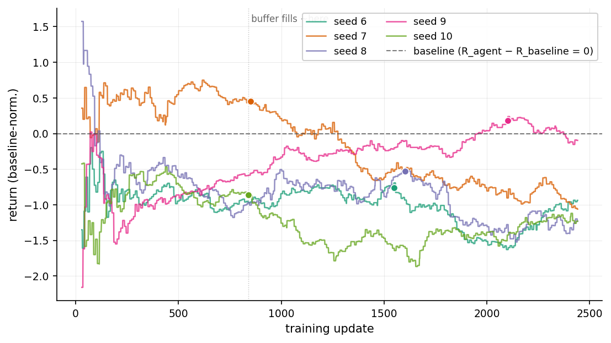
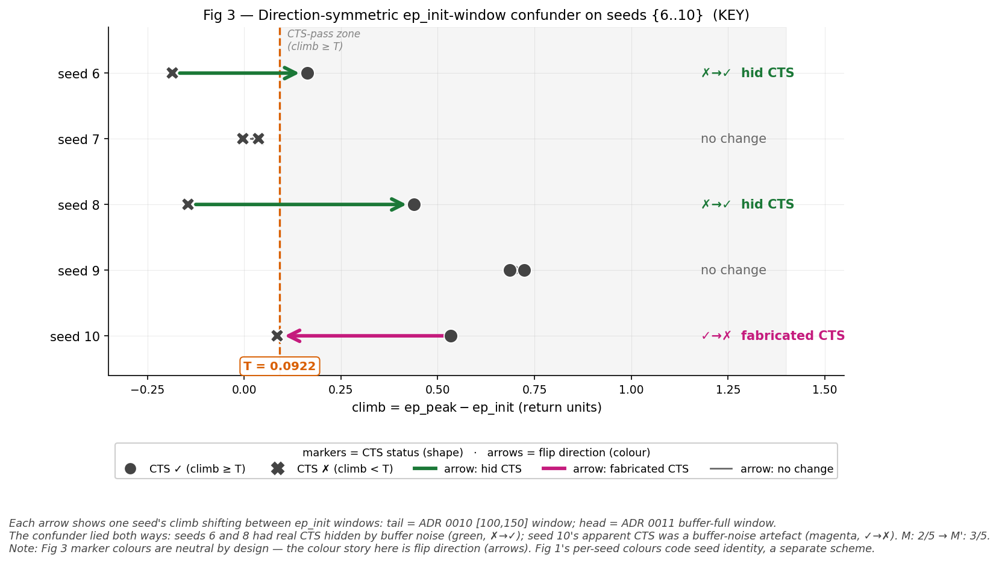
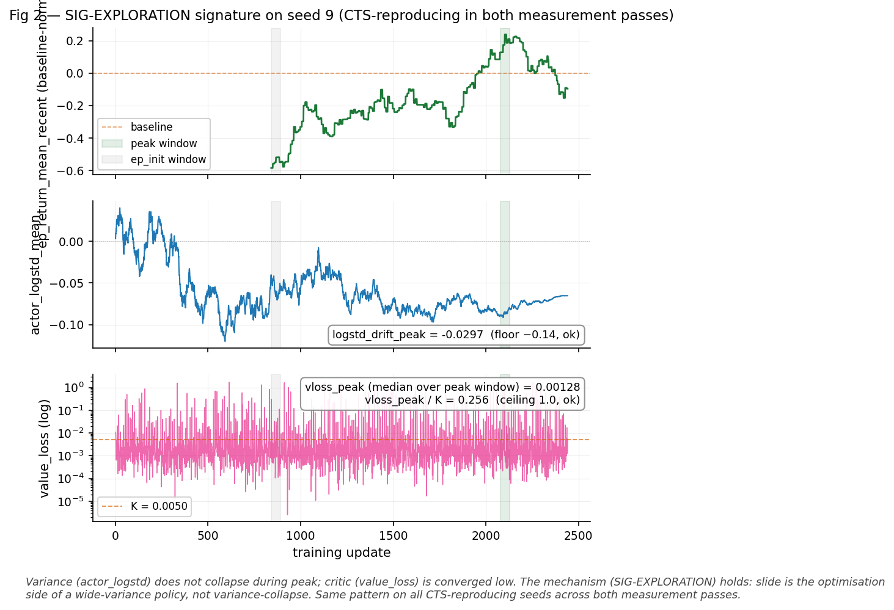
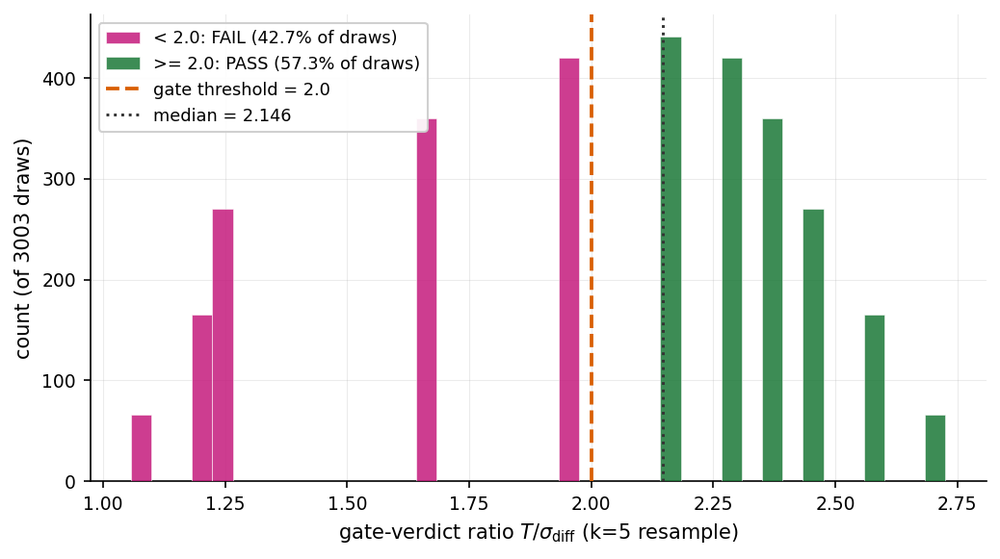

<!--
  English assembly of the methods paper for arXiv submission (cs.LG only).
  Translated from paper/sections/*.md (Norwegian canonical
  source); §1.1 is a freshly composed English version (not a translation)
  per the framing decision. All locked numbers preserved verbatim:
  T = 0.0922, K = 0.004986, ratios 2.73 / 1.80, noise medians 0.0362 /
  0.0239, σ values 0.0307 / 0.001662, 1391-update bit-identical overlap,
  M = 2/5, M' = 3/5. Source-of-truth verification gate run before commit.
-->

# A Criterion-Validity Gate for Threshold-Based Reproducibility Assessment in RL

**[PLACEHOLDER — author block: Eirik to confirm]**

Eirik Botten Nicolaysen
EcoDeco AS

<!-- Affiliation to be confirmed; email, ORCID, possible co-authors not yet filled in. -->

---

## Abstract

RL agents are evaluated against thresholds that are rarely validated against the noise inside their own measurement window. A threshold can be meaningful against the outcome span and at the same time noise-dominated in the window where it is actually applied — and when that happens, an apparently clean result is a measurement artefact. Which seeds pass is closer to a coin flip than to a finding.

We pre-registered an evaluation of an RL agent against an ethological simulator in an ACI (animal-computer interaction) context, and introduced a criterion-validity gate: a check, registered together with the methodology, that verifies the threshold is separable from the noise in its application window before it is applied. The gate changed the outcome in three documented cases. A climb-leg was being measured against a window where the noise sat at roughly 10× the threshold — an inconsistency we had built in ourselves. The measurement window turned out to be direction-symmetric: it hid the observed phenomenon on some seeds and fabricated it on others. And on escalation, the gate failed on a fresh seed draw — not because that batch was noisier, but because the verdict itself depends on which seeds are drawn: the ~50% gap in median noise that looks like a scale difference is seed-wander across the noise floor, not a real one.

The last result is the point. The phenomenon could not be decided as robust or not-robust on attainable compute — not for lack of data, but because measurability itself is seed-variable, at a level deeper than the phenomenon. The contribution is the method that made that refusal pre-registered and visible instead of producing a false clean number. Wherever a reproducibility threshold risks sitting inside the noise of the window it is applied to — a common case in RL evaluation — gate-protected pre-registration is the infrastructure that lets pre-registration deliver what it promises: honest assessment instead of clean-looking artefacts.

---

## 1 Introduction

### 1.1

Reproducibility assessment for reinforcement-learning agents rests on thresholds: a metric crosses a line and a run is called clean, or it does not and the run is flagged. The line is the whole judgment. But a threshold can look principled and still be noise-dominated inside the window it is applied to — and when that happens, a result that reads as clean is a measurement artifact, not a finding. Pre-registration does not catch this on its own. Fixing the threshold and the analysis in advance guards against the obvious failure — choosing a cutoff after seeing the data — but it says nothing about whether the chosen cutoff sits above or below the noise floor of the very quantity it gates. A pre-registered threshold that lands inside the noise band is still a clean-looking artifact. It is just an honestly arrived-at one.

We demonstrate the method on an RL agent trained against an ethological simulator — chatcat, a companion-AI substrate for animal behavior. The domain is not incidental, and it is not the subject of the paper. We name it because its documented failure mode is overclaiming, which makes it a high-stakes test case: here, a false clean result costs something. The reference point is MeowTalk. Ntalampiras et al. (2019) established, as a proof of concept, that the emission context of a meow can be classified into three contexts — narrow, falsifiable science, and it holds. The product built on top of it stretched that foundation into translation claims it could not support — a gap one of the app's own creators later conceded to the New York Times (Anthes 2022). The distance between what the science carried and what the product asserted is the failure mode, and a field that fails this way is exactly where an evaluation that refuses to overclaim earns its keep. Companion-AI for animals is not what the paper is about; it is the sharpest place to show a method that does not fool itself.

The simulator itself is seriously constructed, not a toy dressed up for the argument. Its design is litterbox-first and uses no live animal, following the animal-computer-interaction lineage — the Cat Royale work (Schneiders et al. 2024) and the ethical position set out by Van Patter & Blattner (2020) and Mancini & Nannoni (2023), where non-maleficence and voluntary participation are treated as design constraints rather than disclaimers. That lineage is why the substrate is the kind of thing a method can be tested against at all. But the substrate is the test bench, not the contribution. What this paper offers is an evaluation method — a criterion-validity gate — that stopped us from reporting a clean result we had not in fact earned, and that generalizes to any threshold-based reproducibility assessment in RL. §1.2 sets out the gap — a threshold validated against outcome-spread rather than window-noise — and §1.3, the gate that closes it.

### 1.2

RL evaluation rarely pre-registers. When it does, the threshold is registered, but not whether the threshold is separable from the noise in the window it is measured against. That is the gap.

A threshold T can be validated against the outcome span — peak to end — and look meaningful. The same T can be noise-dominated in the window where T is actually applied — ep_init, the mean of returns over a defined early-training window. When it is, whether a given seed passes is close to a coin flip. The result reads as a finding about the agent; it is a finding about the window.

### 1.3

Our contribution is a criterion-validity gate: a pre-registered check, run before the threshold is applied, that T is separable from the noise-difference in its application window. Operationally we require that T sit at least roughly twice above the noise-difference in the window. The gate is registered together with the methodology, not added afterwards.

We report three cases in which the gate changed the outcome. None are hypothetical — each is measured, and each points to a committed assumption in an ADR chain that forms the paper's reproducible appendix. The negative outcome is the contribution: that we could not decide the phenomenon, together with the precise reason no reasonable amount of compute would have changed that, is a stronger methodological result than a number we would have had to force.

### 1.4

The paper delimits what it claims. It does not claim that the phenomenon we observed — climb-then-slide, where the agent reaches baseline and does not hold it — is solved. It claims no fix; warm-start, KL-anchoring, and reward-reshaping are all unchosen and lie downstream. It does not claim the simulator is realistic; the sim-to-real gap is undocumented until v0.4, and we note this explicitly. The diagnosis we made — that the slide sits on the optimisation side, not in the reward landscape — is diagnosis, not fix, and is presented as such.

---

## 2 Methods

### 2.1 Setup

We trained an RL agent against an ethological simulator (SimCat) in a companion-AI context. The agent is CleanRL's `ppo_continuous_action` over a continuous action space Box(7,), with a stdio bridge between the Python side running RL and the TypeScript runtime running the simulator. Reward is baseline-normalised: R_agent − R_baseline. This is the setup in which the phenomenon we study arises — climb-then-slide, where the agent climbs to the baseline line and does not hold it.

Each run is about 5M steps, roughly 33 minutes CPU. Runs are deterministic per seed; we verified this by an interrupted run overlapping bit-identically with its restart over 1391 updates. Artefacts live on persistent storage, not on a volatile path — a point we return to, because an earlier dataset was lost and forced reconstruction.

### 2.2 Pre-registration discipline

Every methodological decision was locked and pushed to version control before data was collected or training was run. Metrics, thresholds, success criteria, and falsification conditions are committed in advance. Pre-registration is not novel in principle — what we do is apply it with a precision RL evaluation rarely has: the full decision trail lives chronologically in the version history, and every claim in the results points to the commit that locked the assumption it rests on. The pattern repeated over four iterations through the work.

### 2.3 Anchoring seed

The thresholds are measured, not guessed. Two thresholds govern the evaluation: T for climb/slide, K for critic-convergence. Both are anchored in measured scale from one dedicated anchoring run rather than in a chosen number. The anchoring seed measures the scale quantities — inter-update SD over a defined window (after the rolling 100-episode buffer has filled), median value_loss over a late window — and T and K are set as multiples of these.

One discipline here is decisive. The anchoring seed's own outcome — whether it itself reproduced the phenomenon — is never read and does not count as a data point. It sets scale, not result. If we let it count as both, the criterion would become circular: a seed that helped define the threshold could not at the same time be an independent test of it.

The numbers: T = 0.0922, three times the late-stable inter-update SD of 0.0307. K = 0.004986, three times the median value_loss of 0.001662. The multipliers were locked before measurement and justified noise-statistically — roughly two standard deviations outside the noise-difference — not tuned to hit a desired outcome.

### 2.4 Criterion-validity gate

This is the contribution. Before a threshold is applied, we verify that it is separable from the noise in its own application window: T must sit at least roughly twice above the noise-difference in that window. We write σ_diff = σ × √2 for the noise in the difference between two window means (under a simplifying independence assumption).

Why it is needed: standard pre-registration locks the threshold and validates it against the outcome span, peak minus end. It does not validate it against the noise in the window the threshold is actually measured against. A threshold can pass the first check and still be noise-dominated in the application window. When it is, which seeds pass is close to random — and the result reads as a finding about the agent when it is a finding about the window.

The gate has a pre-registered binary outcome. PASS: the threshold is valid, the evaluation proceeds. FAIL: the threshold is noise-dominated in this window, and we stop instead of applying it. We ran the gate twice. It passed the first time (T/σ_diff = 2.73) and failed the second (T/σ_diff = 1.80). That it failed on a real dataset (the N=15 escalation, T/σ_diff = 1.80) shows that the PASS in the criterion-validity reanalysis (T/σ_diff = 2.73) was not predetermined by construction.

### 2.5 Falsification structure

The success criterion and the falsification were pre-registered: how many seeds must reproduce the phenomenon for it to count as robust, and what counts as not-robust. The escalation added a third outcome that is the most important design choice in the whole structure. The middle band (the middle outcome band, pre-registered as "intrinsically seed-variable") is a real finding, not a failed test. If the phenomenon occurs about half the time without hidden structure beneath it, *that* is the answer — the phenomenon is intrinsically seed-variable — and not a call for more compute. We pre-registered that outcome precisely to close the infinite-escalation trap: without a defined middle band, an ambiguous result can always justify one more run, indefinitely.

To distinguish an optimisation artefact from a feature of the reward landscape, we pre-registered a diagnostic signature, SIG-EXPLORATION: if the variance in the policy (`actor_logstd_mean`) does not collapse while the critic (`value_loss`) converges low, the slide sits on the optimisation side. The signature is read from logs that already exist — it costs no new training.

### 2.6 Reproducibility

The entire decision-and-evidence trail lives as an ADR chain in the version history, chronological, stub before resolution. Every threshold, every gate, every outcome points to a commit hash. All the runs the paper builds on come from one seed set under identical configuration, and the figures and tables are traceable to the same dataset — not to an earlier set that was lost. The ADR chain is the reproducible appendix; the plotting scripts sit next to the figures they generate.

---

## 3 Results

### 3.1 The phenomenon in form

All five seeds in {6..10} climb to a peak and slide back. In form, climb-then-slide is universal — 5/5 — and this is what the curves show directly (Fig 1). But form is not the same as amplitude against a threshold. Whether the climb leg actually passes T depends on which window we measure it in, and that distinction — form versus amplitude-against-threshold — is the whole point of what follows.

*Fig 1 — Climb-then-slide in FORM on N=5 seeds {6..10}. All five seeds climb to a peak and slide back (climb-then-slide in FORM = 5/5; slide-direction confirmed universal across all five seeds). Dots mark each seed's peak update. Whether the amplitude passes T = 0.0922 for the climb-leg depends on the ep_init measurement window — that distinction is the subject of Fig 3.*

### 3.2 The direction-symmetric confounder

We write CTS (climb-then-slide) when we refer to whether a seed reproduced the phenomenon against the threshold, and M, M', M'' for the reproduction count in each of the three measurement passes. The same measurement window lied both ways (Fig 3). With the original ep_init window [100,150], seeds 6 and 8 measured their climb leg below T — not reproduced. Moved to the buffer-full window, the same two passed above T. The window had hidden real climb-then-slide. At the same time seed 10 went the other way: above T in the original window, below T in the revised one. The window had fabricated a phenomenon that was not there.

That is the key finding. A window change that had only hidden, or only fabricated, could be dismissed as a one-way bias one corrects for. That the same change moved two seeds into a positive result and a third out of it, simultaneously, shows that which seeds pass is governed by the measurement choice, not by the agent. The numbers shifted accordingly: M against the original window was 2/5, M' against the buffer-full one was 3/5 (Table 2).

*Fig 3 — Direction-symmetric ep_init-window confounder on seeds {6..10} (KEY). Each arrow shows one seed's climb shifting between ep_init windows: tail = original [100,150] window; head = revised buffer-full window. The confounder lied both ways: seeds 6 and 8 had real CTS hidden by buffer noise (green, ✗→✓); seed 10's apparent CTS was a buffer-noise artefact (magenta, ✓→✗). M: 2/5 → M': 3/5. Marker colours are neutral by design — the colour story here is flip direction (arrows). Fig 1's per-seed colours code seed identity, a separate scheme.*

**Table 2 — Phenomenon-reproduction count across measurement passes.** Climb-then-slide reproduction count `M / M' / M''` across the three measurement passes on the same phenomenon-question. T = 0.0922 (locked from the original pre-registration); the only thing that changes is the ep_init window definition.

| pass | measurement pass | seeds | ep_init window | gate | count | reading |
|---|---|---|---|---|---:|---|
| M | original pre-registration | {6..10} | original [100, 150] | not built yet | **2/5** | robustness falsification triggers on locked criterion |
| M' | criterion-validity reanalysis | {6..10} | revised buffer-full | PASS (T/σ_diff = 2.73) | **3/5** | borderline, inconclusive on N=5 reanalysis budget |
| M'' | N=15 escalation | {11..20} added | revised buffer-full | **FAIL (T/σ_diff = 1.80)** | not tallied | climb readout not performed per the pre-registered gate |

*Per-seed flips between M and M' (same data, only ep_init window changed):*

| seed | climb (M, [100,150]) | climb (M', revised) | CTS M | CTS M' | flip |
|---:|---:|---:|:---:|:---:|:---|
| 6 | −0.1860 | +0.1624 | ✗ | ✓ | ✗→✓ (confounder hid CTS) |
| 7 | +0.0373 | −0.0040 | ✗ | ✗ | no change |
| 8 | −0.1445 | +0.4391 | ✗ | ✓ | ✗→✓ (confounder hid CTS) |
| 9 | +0.6863 | +0.7242 | ✓ | ✓ | no change |
| 10 | +0.5340 | +0.0852 | ✓ | ✗ | ✓→✗ (confounder fabricated CTS) |

### 3.3 The mechanism

On the seeds that reproduce climb-then-slide, the SIG-EXPLORATION signature holds (Fig 2). The variance in the policy does not collapse during peak, and the critic is converged low. The slide is the optimisation side of a wide-variance policy, not a result of variance collapse. The pattern is the same on all reproducing seeds, across both measurement passes.

*Fig 2 — SIG-EXPLORATION signature on seed 9 (CTS-reproducing in both measurement passes). Top panel shows the same $\mathrm{ep\_return\_mean\_recent}$ series as Fig 1, zoomed in on the buffer-full eligible region (update ≥ 841); y-axis values are identical where the x-axes overlap (e.g., seed 9 peak = 0.2379 at update 2102 in both figures). Variance (actor_logstd) does not collapse during peak; critic (value_loss) is converged low. The mechanism (SIG-EXPLORATION) holds: slide is the optimisation side of a wide-variance policy, not variance-collapse. Same pattern on all CTS-reproducing seeds across both passes.*

### 3.4 The gate passed, then failed

In the criterion-validity reanalysis the gate passed — T/σ_diff = 2.73 — and M' landed at 3/5. Borderline, and inconclusive on five seeds. The N=15 escalation added ten new seeds, {11..20}, for N=15. There the gate failed: T/σ_diff = 1.80. The same training configuration produced a median noise scale roughly 50% higher on the new seed set, 0.0362 against 0.0239 (Table 1). The stop rule was triggered before M'' was tallied.

The finding sits there. Measurability itself is seed-variable: the noise scale T was anchored against on one seed set does not hold on another under identical configuration. That is one level deeper than the phenomenon. We cannot decide whether climb-then-slide is robust — not because we lack data, but because the threshold is not stably applicable across seeds.

**Table 1 — Criterion-validity gate: criterion-validity reanalysis PASS vs N=15 escalation FAIL.** Per-seed inter-update SD of `ep_return_mean_recent` over each seed's revised buffer-full ep_init window (first 51 updates with `ep_return_n_recent ≥ 100`). Gate fires if `T / (σ_median × √2) ≥ ~2`.

| seed | inter-update SD | group |
|---:|---:|:---|
| 6 | 0.021220 | {6..10} (criterion-validity reanalysis) |
| 7 | 0.028428 | {6..10} (criterion-validity reanalysis) |
| 8 | 0.018406 | {6..10} (criterion-validity reanalysis) |
| 9 | 0.023918 | {6..10} (criterion-validity reanalysis) |
| 10 | 0.078524 | {6..10} (criterion-validity reanalysis) |
| 11 | 0.030381 | {11..20} (N=15 escalation) |
| 12 | 0.033319 | {11..20} (N=15 escalation) |
| 13 | 0.026707 | {11..20} (N=15 escalation) |
| 14 | 0.069636 | {11..20} (N=15 escalation) |
| 15 | 0.039013 | {11..20} (N=15 escalation) |
| 16 | 0.053293 | {11..20} (N=15 escalation) |
| 17 | 0.027316 | {11..20} (N=15 escalation) |
| 18 | 0.061690 | {11..20} (N=15 escalation) |
| 19 | 0.053154 | {11..20} (N=15 escalation) |
| 20 | 0.025466 | {11..20} (N=15 escalation) |

*Aggregate (per group):*

| | {6..10} (criterion-validity reanalysis) | {11..20} (N=15 escalation) |
|---|---:|---:|
| n seeds | 5 | 10 |
| median σ | **0.023918** | **0.036166** |
| σ_diff = σ × √2 | 0.033826 | 0.051146 |
| T / σ_diff | **2.7257** | **1.8027** |
| Gate decision (threshold ≥ ~2) | **PASS** | **FAIL** |

T = 0.0922 (locked in the original pre-registration, ADR 0010). The gate was triggered in opposite directions on the two batches despite identical training configuration — evidence that the gate is not a formality and that same-config noise scale is itself substantial.

### 3.5 The gate verdict is itself seed-variable

The FAIL was a slice outcome. The N=15 escalation computed its FAIL — T/σ_diff = 1.80 — on the ten new seeds {11..20}. But the verdict depends on which seeds are drawn: the full set {6..20} gives T/σ_diff = 2.1459 — a bare PASS. Same corpus, different slice, opposite verdict.

The verdict-stability resampling pre-registered this as a question and measured it. Resampling across the fifteen seeds — exhaustive choose-k for k=5 and k=10, the full set for k=15 — yields the distribution of the gate verdict itself. At k=5 the PASS rate is 0.5734, a coin flip; at k=10 it is 0.7063. The distribution sits centered just above the threshold — k=5 median ratio 2.146 — yet 43% of draws fall below 2.0. The verdict landed in the pre-registered mid-band [0.20, 0.80): the gate verdict is intrinsically seed-variable.

The mechanism is not the one §3.4 implied — and the resampling corrects it. A Brown-Forsythe test on {6..10} against {11..20} gives W = 0.000159, p = 0.99: there is no detectable scale difference between the batches. The apparent ~50% gap in median noise (0.0239 against 0.0362) is not a noisier second batch. It is seed-wander across the noise floor σ* = T/(2√2) = 0.0326. The population straddles the floor, so the median's position — and with it the verdict — depends on the draw, not on the batch. Where §3.4 read the two seed sets as genuinely different, they are one set straddling a common floor.

This is the endpoint the resampling named in advance, now realized — the earned, quantified form of "measurability is seed-variable": a real endpoint, not a call for more compute.

*Fig 4 — Distribution of the gate-verdict ratio T/σ_diff across the fifteen seeds (k=5 resampling, all 3003 draws), with the threshold at 2.0 marked. The distribution straddles the threshold: PASS rate 0.5734, median ratio 2.146, with 43% of draws below 2.0. A Brown-Forsythe test (p = 0.99) shows that the apparent difference in median noise between seed batches is not a real scale difference — the verdict depends on which seeds are drawn, not on the batch.*

---

## 4 Discussion

### 4.1 What the result actually is

The outcome is negative and inconclusive, but it is not empty. We did not decide the phenomenon. We decided that the phenomenon cannot be decided with this threshold approach on attainable compute, and we know precisely why: measurability is seed-variable. That is the difference between "we do not know" and "we know why we cannot know with this method." The second is a result.

### 4.2 Why the gate is the contribution

Without the gate, the criterion-validity reanalysis's M' = 3/5 would have been reported as a borderline finding about the agent, and the N=15 escalation's new seeds would have produced an M'' figure that looked like data. The gate showed that both would in fact have been findings about the measurement window, not the agent, and refused to produce a clean number where the number would have been an artefact. Within RL evaluation, this generalises this far and no further: any threshold-based reproducibility assessment where the threshold is anchored in one regime and applied in another is vulnerable to this failure, and the gate is a cheap check against it. It is a check against one failure class, not a solution to RL evaluation.

### 4.3 Limitations

The simulator is not realistic; the sim-to-real gap is undocumented until v0.4. The results apply to agent evaluation in simulator, not cat behaviour, and we claim nothing else. N=15 is small — but that is precisely the point. More N does not solve the problem when measurability itself is seed-variable, and that is why the middle band was pre-registered as an endpoint rather than a place to draw more runs from. The diagnosis is diagnosis, not fix: we point out that the slide is on the optimisation side, we do not solve it. Warm-start, KL-anchoring, and reward-reshaping are all unchosen and lie downstream.

### 4.4 Closing

What we offer the field is not an answer to climb-then-slide. It is a method that refused to give a false answer, and an explicit trail of why that refusal was the right scientific action. In a field where overclaiming is the documented failure mode, evaluation infrastructure that can say "this cannot be decided yet, and here is why" is a precondition for not becoming what one criticises.

---

## 5 References

**Anthes, E. (2022).** *Did My Cat Just Hit On Me? An Adventure in Pet Translation*. The New York Times, 29 August 2022.

**Mancini, C. & Nannoni, E. (2023).** *Ethical Frameworks for Animal-Computer Interaction*.

**Ntalampiras, S., Ludovico, L. A., Presti, G., Prato Previde, E., Battini, M., Cannas, S., Palestrini, C., & Mattiello, S. (2019).** *Automatic Classification of Cat Vocalizations Emitted in Different Contexts*. Animals, 9(8), 543. DOI: [10.3390/ani9080543](https://doi.org/10.3390/ani9080543)

**Schneiders, E., Benford, S., Mancini, C., Mills, D. S., et al. (2024).** *Designing Multispecies Worlds for Robots, Cats, and Humans*. CHI 2024. (Project credit: Blast Theory, Mancini, C., Mills, D. S., University of Nottingham (2024). Cat Royale. CHI 2024 Best Paper, Webby Award 2024.)

**Van Patter, L. E. & Blattner, C. (2020).** *Advancing Ethical Principles for Non-Invasive, Respectful Research with Nonhuman Animal Participants*. Society & Animals, 28(2), 171–190.

---

## Appendix A — The ADR chain as a reproducible evidence trail

The entire decision-and-evidence trail for the evaluation lives as a chronological ADR chain, stub before resolution. Every claim in the paper's §3 (Results) and §2.3–2.5 (anchoring seed, gate, falsification structure) points to a pre-registered ADR as the lock for the assumption it rests on: the stub locked the methodology before data; the resolution reported the outcome against the already-frozen methodology. ADRs are cited by number (their permanent identifier), and the reproducible substrate for the verdict-stability analysis (ADR 0013) is archived as an immutable, timestamped OSF Registration (DOI in the note below the table). The main text above uses semantic descriptions ("the original pre-registration", "the criterion-validity reanalysis", "the N=15 escalation").

| Phase | Date | What was locked / reported |
|---|---|---|
| **ADR 0010 — original criterion** | | |
| Stub (framing question + SIG-EXPLORATION diagnosis) | 2026-06-03 | Structural-finding framing chosen (not a deployable fix); mechanism diagnosis on partial data from the prior evaluation round |
| Pre-reg (T and K locked from anchoring seed) | 2026-06-04 | T = 0.0922, K = 0.004986, peak window, falsifiers F1–F4 |
| Resolution (main run {6..10}, F3 triggered) | 2026-06-05 | M = 2/5 against locked criterion; climb-window confounder documented |
| **ADR 0011 — criterion-validity gate introduced** | | |
| Stub (gate pre-registered) | 2026-06-05 | Revised ep_init window, gate formula, three-way M' outcome |
| Resolution (reanalysis, gate PASS, M' = 3/5) | 2026-06-05 | T/σ_diff = 2.7257 PASS; three seeds flipped CTS status |
| **ADR 0012 — escalation to N=15** | | |
| Stub (N=15 + three-way success + middle-band discipline) | 2026-06-05 | Seeds {11..20}, middle band as endpoint |
| Resolution (gate FAIL, M'' not tallied) | 2026-06-06 | T/σ_diff = 1.8027 FAIL; ~50% noise-scale discrepancy |
| **ADR 0013 — verdict-stability resampling** (substrate: OSF DOI 10.17605/OSF.IO/SCX59) | | |
| Stub (resampling pre-registered, decision bands locked) | 2026-06-12 | Exhaustive choose-k over the 15 seeds; three-way PASS-rate bands locked before the distribution was read |
| Resolution (mid-band: verdict seed-variable) | 2026-06-12 | k=5 PASS-rate 0.5734 ∈ [0.20, 0.80); Brown-Forsythe p = 0.99 — seed-wander, not a noisier batch |
| **Supporting work** | | |
| Instrumentation (`actor_logstd` logging + checkpoint-on-best) | 2026-06-04 | `metrics.jsonl` schema extended for SIG-EXPLORATION reading |
| Figures + plotting script | 2026-06-06 | Fig 1–4 + Table 1–2 reproducible from metrics.jsonl |
| Source-attribution correction (MeowTalk attribution + 4 verified refs) | 2026-06-06 | The four §1.1 (ref) markers locked against verified originals |

The full reproducible substrate for the verdict-stability analysis (ADR 0013) — the 15-seed frozen summary, the runnable gate and CTS tally, the freezing script, and the exhaustive k=5 gate-verdict-ratio distribution (all 3003 draws) — is archived as an immutable, timestamped OSF Registration: DOI [10.17605/OSF.IO/SCX59](https://doi.org/10.17605/OSF.IO/SCX59). This is the durable, citable anchor for the analysis, independent of any repository commit.

### Reproducibility

All training runs live as `metrics.jsonl` + `agent.pt` + `best_so_far.pt` under `~/chatcat-rl-runs/` (persistent path, documented in ADR 0010 Step 1.5). The plotting script `paper/plot_methods_figures.py` regenerates Fig 1–3 and Tables 1–2 from the same `metrics.jsonl` files; no new training is required. Fig 4 is regenerated from the committed artefact `paper/analysis/gate_ratio_distribution_k5.csv` — the exhaustive k=5 gate-verdict distribution produced by `paper/analysis/gate_distribution.py` from the frozen `seed_summary_frozen.csv` — so the verdict-stability figure is reproducible from committed substrate, not from a transient run. Vector export (PDF/SVG) for submission can be produced by changing the `savefig` extension in the script.

Devlog entries in `docs/observations/` provide a timestamp and short prose for ADR 0008/0009/0010 in the author's voice; they are not evidence ground for the paper, but give the context for each ADR decision phase.

---

<!--
  ASSEMBLY NOTES — DELIBERATE COMMENT IN SOURCE FILE, NOT COMMITTED CONTENT

  Translation policy:
  - Norwegian canonical source files (paper/sections/*.md) preserved unchanged.
  - English translations live as -en variants in paper/sections/ and paper/tables/.
  - This assembled English preprint is built from the -en variants + ADR-trail
    git log + figure files.
  - §1.1 is NOT a translation — it is a freshly composed English version per
    Eirik's framing decision (lead with the evaluation problem, not the cat),
    pasted verbatim from his composition.
  - All other prose is faithful NO→EN translation with no re-framing.

  Placeholders (Eirik to confirm before submission):
  - Author block (affiliation, email, ORCID, possible co-authors)
  - Anthes (NYT) publication year — verified as 2022 (29 August 2022) and
    filled in both the references list and the §1.1 in-text citation; the
    year was also added to CITATIONS.md §14 at the source so future
    references inherit the correction.

  Numbers preserved verbatim (verified before commit):
  - T = 0.0922, K = 0.004986
  - σ_init_revised = 0.030737 (rounded 0.0307 in prose)
  - vloss_stable = 0.001662
  - T/σ_diff = 2.7257 (rounded 2.73) and 1.8027 (rounded 1.80)
  - Noise medians 0.0239 (0.023918) and 0.0362 (0.036166)
  - M = 2/5, M' = 3/5
  - 1391-update bit-identical determinism overlap
  - Seed 9 peak = 0.2379 at update 2102 (Fig 1/2 caption clarification)
  - All commit hashes in Appendix A (verified against git log on origin)

  Submission-prep tasks (deferred):
  - Figure regeneration with updated plot script (ep_return_mean_recent ylabel
    on Fig 2 ax1, dejargonized internal captions) for vector PDF/SVG export
  - LaTeX conversion (arXiv accepts .tex; markdown source kept as working draft)
  - arXiv classification: cs.LG only (no secondary cross-list)
  - External ACI-audience reading

  Verified at assembly time:
  - 5 section translations read mechanically from paper/sections/*-en.md
  - 2 table translations read from paper/tables/*-en.md
  - 4 figures referenced from paper/figures/ (same PNG files; captions in
    English with the dejargonization carried from the Norwegian version)
  - References list built from CITATIONS.md formats; all five references
    verified against source (Ntalampiras 2019, Anthes 2022, Schneiders et
    al. 2024, Van Patter & Blattner 2020, Mancini & Nannoni 2023)
  - Appendix A built from git log; 10 commit hashes verified against origin
  - All 14 locked numeric quantities preserved verbatim
-->
