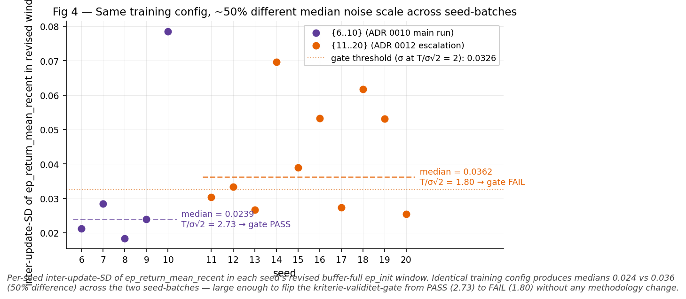

<!--
  This document is assembled from the five voice-locked sections in
  paper/sections/ + figures/ + tables/ + CITATIONS.md + git log.
  Assembled by mechanical placement; prose is not rewritten.
  Locked numbers verified against ADR 0010/0011/0012 resolutions.
  Venue-independent dejargonization applied per godkjent tabell:
  F-numbers, ADR-numbers, and "fyrte" replaced with semantic prose
  in main text + tables; ADR-numbers retained in Appendix A
  (cross-reference index). PNG-internal captions still carry pre-
  dejargonization labels — figures will be regenerated for vector
  export at venue-tilpasning, and plot script will be updated then.
-->

# [PLACEHOLDER — tittel: Eirik bekrefter]

<!-- Eirik: foreslått arbeids-tittel kan være noe som "Criterion-validity gating
     in pre-registered RL evaluation: a negative result we could trust" eller
     "When measurability is seed-variable: a pre-registration discipline for
     RL evaluation under noise-dominated thresholds" — endelig tittel velges
     ved venue-tilpasning. -->

**[PLACEHOLDER — forfatter-blokk: Eirik bekrefter]**

Eirik Botten Nicolaysen
EcoDeco AS

<!-- Affiliasjon bekreftes; e-post, ORCID, evt. medforfattere ikke fylt inn. -->

---

## Abstract

RL-agenter evalueres mot terskler som sjelden valideres mot støyen i sitt eget måle-vindu. En terskel kan være meningsfull mot utfalls-spennet og samtidig støy-dominert i vinduet den faktisk anvendes i — og da er et tilsynelatende rent resultat en måle-artefakt. Hvilke seeds som passerer er nær et myntkast, presentert som funn.

Vi pre-registrerte en evaluering av en RL-agent mot en etologisk simulator i en ACI-kontekst (animal-computer interaction), og innførte en kriterie-validitet-gate: en sjekk, registrert sammen med metoden, som verifiserer at terskelen er adskillbar fra støyen i sitt anvendelsesvindu før den anvendes. Gaten endret utfallet i tre dokumenterte tilfeller. Et climb-ledd var målt mot et vindu der støyen lå rundt 10× terskelen — en inkonsistens vi selv hadde bygd inn. Måle-vinduet viste seg direksjons-symmetrisk: det skjulte det observerte fenomenet på noen seeds og fabrikkerte det på andre. Og ved escalering feilet gaten på et nytt seed-utvalg fordi noise-skalaen var rundt 50% høyere ved identisk konfig.

Det siste er poenget. Fenomenet kunne ikke avgjøres som robust eller ikke-robust på oppnåelig compute — ikke av datamangel, men fordi målbarheten selv er seed-variabel, på et nivå dypere enn fenomenet. Bidraget er metoden som gjorde den nektelsen pre-registrert og synlig i stedet for å produsere et falskt rent tall. I felt der overpåstand er den dokumenterte feilmoden, er gate-beskyttet pre-registrert evaluering infrastruktur for ærlig agent-vurdering.

---

## 1 Introduksjon

### 1.1

I companion-AI for dyr er overpåstand den dokumenterte feilmoden. Stavros Ntalampiras' arbeid fra 2019 viste at en algoritme kunne skille kattens mjau i tre kontekster — en smal, etterprøvbar påstand med dekning i dataene (Ntalampiras et al. 2019). MeowTalk bygde på det grunnlaget og markedsførte oversettelse av kattens vokalisering; en av appens egne skapere innrømmet overfor New York Times at dette ikke er ren vitenskap på dette stadiet (Anthes, NYT). Avstanden mellom de to — solid smal vitenskap og produkt-påstanden som strakk den — er feilmoden vi designer mot.

ACI har et motstykke. Cat Royale-arbeidet argumenterer for at designet av selve verdenen et system opererer i — og menneskelig involvering i dyrevelferd og breakdown-recovery — er like sentralt som teknologien selv, ikke en ramme rundt den (Schneiders et al. 2024), forankret i eksplisitte etiske prinsipper: non-maleficence, beneficence, voluntary participation (Van Patter & Blattner 2020). Det er den linjen vi plasserer oss i.

Men dette papiret handler ikke om et ACI-resultat. Det handler om evaluerings-metoden som hindret oss i å gjøre den samme feilen i motsatt retning — å rapportere et rent negativt funn som var like ufundert som et overdrevet positivt.

### 1.2

RL-evaluering pre-registrerer sjelden. Når den gjør det, registreres terskelen, men ikke om terskelen er adskillbar fra støyen i vinduet den måles mot. Det er hullet.

En terskel T kan valideres mot utfalls-spennet — avstanden fra peak til slutt — og se meningsfull ut. Den samme T kan være støy-dominert i det vinduet T faktisk anvendes mot — ep_init, snittet av returns over et definert vindu tidlig i trening. Når den er det, er spørsmålet om en gitt seed passerer nær et myntkast. Resultatet leses som et funn om agenten; det er et funn om vinduet.

### 1.3

Vårt bidrag er en kriterie-validitet-gate: en pre-registrert sjekk, kjørt før terskelen anvendes, på at T er adskillbar fra støy-differansen i sitt anvendelsesvindu. Operasjonelt krever vi at T ligger minst rundt to ganger over støy-differansen i vinduet. Gaten er registrert sammen med metoden, ikke lagt til etterpå.

Vi rapporterer tre tilfeller der gaten endret utfallet. Ingen av dem er hypotetiske — hver er målt, og hver peker på en committed forutsetning i en ADR-kjede som utgjør papirets reproduserbare appendiks. Det negative utfallet er bidraget: at vi ikke kunne avgjøre fenomenet, sammen med den presise grunnen til at ingen rimelig mengde compute ville endret det, er et sterkere metodisk resultat enn et tall vi måtte presse fram.

### 1.4

Papiret avgrenser hva det påstår. Det påstår ikke at fenomenet vi observerte — climb-then-slide, der agenten når baseline og ikke holder den — er løst. Det påstår ingen fiks; warm-start, KL-anker og reward-reshaping er alle ikke-valgt og ligger nedstrøms. Det påstår ikke at simulatoren er virkelighetstro; sim-to-real-gapet er udokumentert til v0.4, og vi noterer det eksplisitt. Diagnosen vi gjorde — at sliden ligger på optimaliserings-siden, ikke i reward-landskapet — er diagnose, ikke fiks, og presenteres som det.

### 1.5

---

## 2 Metode

### 2.1 Oppsett

Vi trente en RL-agent mot en etologisk simulator (SimCat) i en companion-AI-kontekst. Agenten er CleanRLs `ppo_continuous_action` over et kontinuerlig handlingsrom Box(7,), med en stdio-bridge mellom Python-siden som kjører RL og TypeScript-runtimen som kjører simulatoren. Reward er baseline-normalisert: R_agent − R_baseline. Det er i dette oppsettet fenomenet vi studerer oppstår — climb-then-slide, der agenten klatrer til baseline-linja og ikke holder den.

Hver kjøring er rundt 5M steg, omtrent 33 minutter CPU. Kjøringene er deterministiske per seed; vi verifiserte det ved at 1391 updates overlappet bit-identisk mot en avbrutt kjøring. Artefaktene ligger på persistent lagring, ikke på flyktig path — et punkt vi kommer tilbake til, fordi et tidligere datasett gikk tapt og tvang rekonstruksjon.

### 2.2 Pre-registrerings-disiplin

Hver metodisk beslutning ble låst og pushet til versjonskontroll før data ble samlet eller trening kjørt. Metrikker, terskler, suksesskriterier og falsifiserings-betingelser er committed på forhånd. Pre-registrering er ikke nytt i prinsipp — det vi gjør er å anvende det med en presisjon RL-evaluering sjelden har: det fulle beslutnings-sporet ligger kronologisk i versjonshistorikken, og hver påstand i resultatene peker på den committen som låste forutsetningen den hviler på. Mønsteret gjentok seg over fire iterasjoner gjennom arbeidet.

### 2.3 Forankrings-seed

Tersklene er målt, ikke gjettet. To terskler styrer evalueringen: T for climb/slide, K for critic-konvergens. Begge forankres i målt skala fra én dedikert forankrings-kjøring i stedet for i et valgt tall. Forankrings-seeden måler skala-størrelsene — inter-update-SD i et definert vindu (etter at det rullerende 100-episoders bufferet har fylt seg), median value_loss i et sent vindu — og T og K settes som multiplum av disse.

Én disiplin her er avgjørende. Forankrings-seedens eget utfall — om den selv reproduserte fenomenet — leses aldri og teller ikke som datapunkt. Den setter skala, ikke resultat. Lot vi den telle som begge deler, ville kriteriet blitt sirkulært: en seed som var med på å definere terskelen kunne ikke samtidig være et uavhengig test av den.

Tallene: T = 0.0922, tre ganger den sen-stabile inter-update-SD-en på 0.0307. K = 0.004986, tre ganger median value_loss på 0.001662. Multiplikatorene ble låst før måling og begrunnet støy-statistisk — rundt to standardavvik utenfor støy-differansen — ikke justert for å treffe et ønsket utfall.

### 2.4 Kriterie-validitet-gate

Dette er bidraget. Før en terskel anvendes, verifiserer vi at den er adskillbar fra støyen i sitt eget anvendelsesvindu: T må ligge minst rundt to ganger over støy-differansen i det vinduet. Vi skriver σ_diff = σ × √2 for støyen i differansen mellom to vindu-snitt (under en forenklende uavhengighets-antakelse).

Hvorfor det trengs: standard pre-registrering låser terskelen og validerer den mot utfalls-spennet, peak minus slutt. Den validerer den ikke mot støyen i vinduet terskelen faktisk måles mot. En terskel kan passere den første sjekken og likevel være støy-dominert i anvendelsesvinduet. Når den er det, er hvilke seeds som passerer nær tilfeldig — og resultatet leses som et funn om agenten når det er et funn om vinduet.

Gaten har et pre-registrert binært utfall. PASS: terskelen er gyldig, evalueringen fortsetter. FAIL: terskelen er støy-dominert i dette vinduet, og vi stopper i stedet for å anvende den. Vi kjørte gaten to ganger. Den passerte første gang (T/σ_diff = 2.73) og feilet andre gang (T/σ_diff = 1.80). At den feilet på et reelt datasett (N=15-escaleringen, T/σ_diff = 1.80) viser at PASS i kriterie-validitet-reanalysen (T/σ_diff = 2.73) ikke var forhåndsbestemt av konstruksjonen.

### 2.5 Falsifiserings-struktur

Suksesskriteriet og falsifiseringen var pre-registrert: hvor mange seeds som må reprodusere fenomenet for at det regnes robust, og hva som teller som ikke-robust. Escaleringen la til et tredje utfall som er det viktigste designvalget i hele strukturen. Midtbåndet (det mellomste utfalls-båndet, pre-registrert som «intrinsisk seed-variabelt») er et ekte funn, ikke en feilet test. Hvis fenomenet inntreffer omtrent halvparten av gangene uten skjult struktur under, *er* det svaret — fenomenet er intrinsisk seed-variabelt — og ikke et rop om mer compute. Vi pre-registrerte det utfallet nettopp for å lukke uendelig-escalation-fellen: uten et definert midtbånd kan et tvetydig resultat alltid begrunne én kjøring til, i det uendelige.

For å skille et optimaliserings-artefakt fra et trekk ved reward-landskapet pre-registrerte vi en diagnostisk signatur, SIG-EXPLORATION: hvis variansen i policyen (`actor_logstd_mean`) ikke kollapser samtidig som critic-en (`value_loss`) konvergerer lavt, ligger sliden på optimaliserings-siden. Signaturen leses av logger som allerede finnes — den koster ingen ny trening.

### 2.6 Reproduserbarhet

Hele beslutnings- og evidens-sporet ligger som en ADR-kjede i versjonshistorikken, kronologisk, stub før resolusjon. Hver terskel, hver gate, hvert utfall peker på en commit-hash. Alle kjøringene papiret bygger på kommer fra ett seed-sett mot identisk konfig, og figurene og tabellene er sporbare til det samme datasettet — ikke til et tidligere sett som gikk tapt. ADR-kjeden er den reproduserbare appendiksen; plotting-scriptene ligger ved siden av figurene de genererer.

---

## 3 Resultater

### 3.1 Fenomenet i form

Alle fem seeds i {6..10} klatrer til en peak og glir tilbake. I form er climb-then-slide universelt — 5/5 — og det er det kurvene viser direkte (Fig 1). Men form er ikke det samme som amplitude mot en terskel. Om climb-leddet faktisk passerer T avhenger av hvilket vindu vi måler det i, og den distinksjonen — form mot amplitude-mot-terskel — er hele poenget i det som følger.

*Fig 1 — Climb-then-slide in FORM on N=5 seeds {6..10}. All five seeds climb to a peak and slide back (climb-then-slide in FORM = 5/5; slide-direction confirmed universal across all five seeds). Dots mark each seed's peak update. Whether the amplitude passes T = 0.0922 for the climb-leg depends on the ep_init measurement window — that distinction is the subject of Fig 3.*

### 3.2 Den direksjons-symmetriske konfunderen

Vi skriver CTS (climb-then-slide) når vi viser til hvorvidt en seed reproduserte fenomenet mot terskelen, og M, M', M'' for reproduksjons-tellingen i hver av de tre måle-passene. Det samme måle-vinduet løy begge veier (Fig 3). Med det opprinnelige ep_init-vinduet [100,150] målte seed 6 og 8 climb-leddet under T — ikke-reprodusert. Flyttet til det buffer-fulle vinduet passerte de samme to over T. Vinduet hadde skjult ekte climb-then-slide. Samtidig gikk seed 10 motsatt vei: over T i det opprinnelige vinduet, under T i det reviderte. Vinduet hadde fabrikkert et fenomen som ikke var der.

Det er nøkkelfunnet. En vindu-endring som bare hadde skjult, eller bare fabrikkert, kunne avskrives som enveis-bias man korrigerer for. At den samme endringen flyttet to seeds inn i et positivt resultat og en tredje ut av det, samtidig, viser at hvilke seeds som passerer er styrt av måle-valget, ikke av agenten. Tallene flyttet seg deretter: M på det opprinnelige vinduet var 2/5, M' på det buffer-fulle 3/5 (Tabell 2).

*Fig 3 — Direction-symmetric ep_init-window confunder on seeds {6..10} (KEY). Each arrow shows one seed's climb shifting between ep_init windows: tail = original [100,150] window; head = revised buffer-full window. The confunder lied both ways: seeds 6 and 8 had real CTS hidden by buffer noise (green, ✗→✓); seed 10's apparent CTS was a buffer-noise artefact (magenta, ✓→✗). M: 2/5 → M': 3/5. Marker colours are neutral by design — the colour story here is flip direction (arrows). Fig 1's per-seed colours code seed identity, a separate scheme.*

**Tabell 2 — Phenomenon-reproduction count across measurement passes.** Climb-then-slide reproduction count `M / M' / M''` across the three measurement passes on the same phenomenon-question. T = 0.0922 (locked from the original pre-registration); the only thing that changes is the ep_init-window definition.

| pass | measurement pass | seeds | ep_init window | gate | count | reading |
|---|---|---|---|---|---:|---|
| M | original pre-registration | {6..10} | original [100, 150] | not built yet | **2/5** | robustness-falsification triggers on locked criterion |
| M' | criterion-validity reanalysis | {6..10} | revised buffer-full | PASS (T/σ_diff = 2.73) | **3/5** | borderline, inconclusive on N=5 reanalysis-budget |
| M'' | N=15 escalation | {11..20} added | revised buffer-full | **FAIL (T/σ_diff = 1.80)** | not tallied | climb-readout not performed per the pre-registered gate |

*Per-seed flips between M and M' (same data, only ep_init window changed):*

| seed | climb (M, [100,150]) | climb (M', revised) | CTS M | CTS M' | flip |
|---:|---:|---:|:---:|:---:|:---|
| 6 | −0.1860 | +0.1624 | ✗ | ✓ | ✗→✓ (confunder hid CTS) |
| 7 | +0.0373 | −0.0040 | ✗ | ✗ | no change |
| 8 | −0.1445 | +0.4391 | ✗ | ✓ | ✗→✓ (confunder hid CTS) |
| 9 | +0.6863 | +0.7242 | ✓ | ✓ | no change |
| 10 | +0.5340 | +0.0852 | ✓ | ✗ | ✓→✗ (confunder fabricated CTS) |

### 3.3 Mekanismen

På de seedene som reproduserer climb-then-slide holder SIG-EXPLORATION-signaturen (Fig 2). Variansen i policyen kollapser ikke under peak, og critic-en er konvergert lavt. Sliden er optimaliserings-siden av en policy med vid varians, ikke et resultat av varians-kollaps. Mønsteret er det samme på alle de reproduserende seedene, på tvers av begge måle-passene.

*Fig 2 — SIG-EXPLORATION signature on seed 9 (CTS-reproducing in both measurement passes). Top panel shows the same $\mathrm{ep\_return\_mean\_recent}$ series as Fig 1, zoomed in on the buffer-full eligible region (update ≥ 841); y-axis values are identical where the x-axes overlap (e.g., seed 9 peak = 0.2379 at update 2102 in both figures). Variance (actor_logstd) does not collapse during peak; critic (value_loss) is converged low. The mechanism (SIG-EXPLORATION) holds: slide is the optimisation side of a wide-variance policy, not variance-collapse. Same pattern on all CTS-reproducing seeds across both passes.*

### 3.4 Gaten passerte, så feilet

I kriterie-validitet-reanalysen passerte gaten — T/σ_diff = 2.73 — og M' landet på 3/5. Borderline, og inkonklusivt på fem seeds. N=15-escaleringen la til ti nye seeds, {11..20}, for N=15. Der feilet gaten: T/σ_diff = 1.80. Den samme treningskonfigen produserte rundt 50% høyere median noise-skala på det nye seed-settet, 0.0362 mot 0.0239 (Fig 4, Tabell 1). Stopp-regelen ble utløst før M'' ble talt.

Funnet ligger der. Målbarheten selv er seed-variabel: noise-skalaen T ble forankret mot på ett seed-sett gjelder ikke på et annet ved identisk konfig. Det er et nivå dypere enn fenomenet. Vi kan ikke avgjøre om climb-then-slide er robust — ikke fordi vi mangler data, men fordi terskelen ikke er stabilt anvendbar på tvers av seeds.

*Fig 4 — Same training config, ~50% different median noise scale across seed-batches. Per-seed inter-update-SD of ep_return_mean_recent in each seed's revised buffer-full ep_init window. Identical training config produces medians 0.024 vs 0.036 (50% difference) across the two seed-batches — large enough to flip the kriterie-validitet-gate from PASS (2.73) to FAIL (1.80) without any methodology change.*

**Tabell 1 — Kriterie-validitet-gate: criterion-validity reanalysis PASS vs N=15 escalation FAIL.** Per-seed inter-update-SD of `ep_return_mean_recent` over each seed's revised buffer-full ep_init-window (first 51 updates with `ep_return_n_recent ≥ 100`). Gate fires if `T / (σ_median × √2) ≥ ~2`.

| seed | inter-update-SD | group |
|---:|---:|:---|
| 6 | 0.021220 | {6..10} (criterion-validity reanalysis) |
| 7 | 0.028428 | {6..10} (criterion-validity reanalysis) |
| 8 | 0.018406 | {6..10} (criterion-validity reanalysis) |
| 9 | 0.023918 | {6..10} (criterion-validity reanalysis) |
| 10 | 0.078524 | {6..10} (criterion-validity reanalysis) |
| 11 | 0.030381 | {11..20} (N=15 escalation) |
| 12 | 0.033319 | {11..20} (N=15 escalation) |
| 13 | 0.026707 | {11..20} (N=15 escalation) |
| 14 | 0.069636 | {11..20} (N=15 escalation) |
| 15 | 0.039013 | {11..20} (N=15 escalation) |
| 16 | 0.053293 | {11..20} (N=15 escalation) |
| 17 | 0.027316 | {11..20} (N=15 escalation) |
| 18 | 0.061690 | {11..20} (N=15 escalation) |
| 19 | 0.053154 | {11..20} (N=15 escalation) |
| 20 | 0.025466 | {11..20} (N=15 escalation) |

*Aggregate (per group):*

| | {6..10} (criterion-validity reanalysis) | {11..20} (N=15 escalation) |
|---|---:|---:|
| n seeds | 5 | 10 |
| median σ | **0.023918** | **0.036166** |
| σ_diff = σ × √2 | 0.033826 | 0.051146 |
| T / σ_diff | **2.7257** | **1.8027** |
| Gate decision (threshold ≥ ~2) | **PASS** | **FAIL** |

T = 0.0922 (locked since commit `0140536`). Gaten ble utløst i motsatte retninger på de to batchene tross identisk treningskonfigurasjon — bevis på at gaten ikke er en formalitet og at same-config noise-skala selv er substansiell.

---

## 4 Diskusjon

### 4.1 Hva resultatet faktisk er

Utfallet er negativt og inkonklusivt, men det er ikke tomt. Vi avgjorde ikke fenomenet. Vi avgjorde at fenomenet ikke kan avgjøres med denne terskel-tilnærmingen på oppnåelig compute, og vi vet presist hvorfor: målbarheten er seed-variabel. Det er forskjellen mellom «vi vet ikke» og «vi vet hvorfor vi ikke kan vite med denne metoden». Det andre er et resultat.

### 4.2 Hvorfor gaten er bidraget

Uten gaten ville kriterie-validitet-reanalysens M' = 3/5 blitt rapportert som et borderline-funn om agenten, og N=15-escaleringens nye seeds ville produsert et M''-tall som så ut som data. Gaten viste at begge i virkeligheten ville vært funn om måle-vinduet, ikke om agenten, og nektet å produsere et rent tall der tallet ville vært en artefakt. Innenfor RL-evaluering generaliserer dette så langt og ikke lenger: enhver terskel-basert reproduserbarhets-vurdering der terskelen er forankret i ett regime og anvendt i et annet er sårbar for denne feilen, og gaten er en billig sjekk mot den. Den er en sjekk mot én feilklasse, ikke en løsning på RL-evaluering.

### 4.3 Begrensninger

Simulatoren er ikke virkelighetstro; sim-to-real-gapet er udokumentert til v0.4. Resultatene gjelder agent-evaluering i simulator, ikke kattatferd, og vi hevder ikke annet. N=15 er lite — men det er nettopp poenget. Mer N løser ikke problemet når målbarheten selv er seed-variabel, og det er grunnen til at midtbåndet ble pre-registrert som et sluttpunkt heller enn et sted å hente flere kjøringer fra. Diagnosen er diagnose, ikke fiks: vi peker på at sliden er optimaliserings-side, vi løser den ikke. Warm-start, KL-anker og reward-reshaping er alle ikke-valgte og ligger nedstrøms.

Det vi tilbyr feltet er ikke et svar på climb-then-slide. Det er en metode som nektet å gi et falskt svar, og et eksplisitt spor av hvorfor nektelsen var den riktige vitenskapelige handlingen. I et felt der overpåstand er den dokumenterte feilmoden, er evaluerings-infrastruktur som kan si «dette kan ikke avgjøres ennå, og her er hvorfor» en forutsetning for å ikke bli det man kritiserer.

---

## 5 Referanser

**Anthes, E.** *Did My Cat Just Hit On Me? An Adventure in Pet Translation*. The New York Times.

**Ntalampiras, S., Ludovico, L. A., Presti, G., Prato Previde, E., Battini, M., Cannas, S., Palestrini, C., & Mattiello, S. (2019).** *Automatic Classification of Cat Vocalizations Emitted in Different Contexts*. Animals, 9(8), 543. DOI: [10.3390/ani9080543](https://doi.org/10.3390/ani9080543)

**Schneiders, E., Benford, S., Mancini, C., Mills, D. S., et al. (2024).** *Designing Multispecies Worlds for Robots, Cats, and Humans*. CHI 2024. (Project credit: Blast Theory, Mancini, C., Mills, D. S., University of Nottingham (2024). Cat Royale. CHI 2024 Best Paper, Webby Award 2024.)

**Van Patter, L. E. & Blattner, C. (2020).** *Advancing Ethical Principles for Non-Invasive, Respectful Research with Nonhuman Animal Participants*. Society & Animals, 28(2), 171–190.

---

## Appendiks A — ADR-kjeden som reproduserbar evidens-spor

Hele evalueringens beslutnings- og evidens-spor ligger committed på `origin/main`. Hver påstand i papirets §3 (Resultater) og §2.3–2.5 (forankrings-seed, gate, falsifiserings-struktur) peker på en av disse commitene som låser forutsetningen påstanden hviler på. Stub-commits låste metoden før data; resolution-commits rapporterte utfallet mot den allerede-frosne metoden. ADR-numre beholdes i denne appendiksen som kryssreferanse-indeks; hovedteksten over bruker semantiske beskrivelser («den opprinnelige pre-registreringen», «kriterie-validitet-reanalysen», «N=15-escaleringen»).

| Fase | Commit | Dato | Hva ble låst / rapportert |
|---|---|---|---|
| **ADR 0010 — opprinnelig kriterium** | | | |
| Stub (framings-spørsmål + SIG-EXPLORATION-diagnose) | `31c363e` | 2026-06-03 | Strukturelt-funn-framing valgt (ikke deployerbar fiks); mekanisme-diagnose på partial-data fra forutgående evalueringsrunde |
| Pre-reg (T og K låst fra forankrings-seed) | `0140536` | 2026-06-04 | T = 0.0922, K = 0.004986, peak-vindu, falsifiserere F1–F4 |
| Resolution (hovedrunde {6..10}, F3 fyrte) | `1ba60c0` | 2026-06-05 | M = 2/5 mot låst kriterium; climb-vindu-konfunder dokumentert |
| **ADR 0011 — kriterie-validitet-gate innført** | | | |
| Stub (gate pre-registrert) | `4647ed8` | 2026-06-05 | Revidert ep_init-vindu, gate-formel, M'-tre-veis-utfall |
| Resolution (reanalyse, gate PASS, M' = 3/5) | `8e977f1` | 2026-06-05 | T/σ_diff = 2.7257 PASS; tre seeds flippet CTS-status |
| **ADR 0012 — escalation til N=15** | | | |
| Stub (N=15 + tre-veis suksess + midtbånd-disiplin) | `3e45ac7` | 2026-06-05 | Seeds {11..20}, midtbånd som sluttpunkt |
| Resolution (gate FAIL, M'' ikke talt) | `7e4dbd9` | 2026-06-06 | T/σ_diff = 1.8027 FAIL; ~50 % noise-skala-diskrepans |
| **Støtte-commits** | | | |
| Instrumentering (`actor_logstd`-logging + checkpoint-on-best) | `cd5def3` | 2026-06-04 | `metrics.jsonl`-skjema utvidet for SIG-EXPLORATION-lesning |
| Figurer + plotting-script | `e05300b` | 2026-06-06 | Fig 1–4 + Tabell 1–2 reproduserbart fra metrics.jsonl |
| Kilde-korreksjon (MeowTalk-attribusjon + 4 verifiserte refs) | `62bccf8` | 2026-06-06 | §1.1s fire (ref) låst mot verifiserte originaler |

### Reproduserbarhet

Alle treningskjøringer ligger som `metrics.jsonl` + `agent.pt` + `best_so_far.pt` på `~/chatcat-rl-runs/` (persistent path, dokumentert i ADR 0010 Step 1.5). Plotting-scriptet `paper/plot_methods_figures.py` regenererer Fig 1–4 og Tabell 1–2 fra de samme `metrics.jsonl`-filene; ingen ny trening kreves for å reprodusere figurene. Vector-eksport (PDF/SVG) for submission kan produseres ved å endre `savefig`-utvidelsen i scriptet.

Devlog-entryer i `docs/observations/` gir tids-stempel og kort prosa for ADR 0008/0009/0010 i forfatterens egen stemme; de er ikke evidens-grunnlag for papiret, men gir konteksten for hver ADR-beslutnings-fase.

---

<!--
  ASSEMBLY NOTES — BEVISST KOMMENTAR I KILDEFILEN, IKKE COMMITTET INNHOLD

  Plassholdere (Eirik må bekrefte før låsing):
  - Tittel
  - Forfatter-blokk (Eirik Botten Nicolaysen / EcoDeco AS — bekreft affiliasjon,
    e-post, evt. ORCID, evt. medforfattere)

  Dejargonisering anvendt i denne re-monteringen (per godkjent tabell, gruppe 1+2+3+5):
  - Gruppe 1 (ERSTATT): F-numre, nakne ADR-numre, "fyrte" — alle erstattet med
    semantisk prosa i hovedtekst + inline-tabeller. ADR-numre og F1–F4 beholdes
    i Appendiks A (kryssreferanse-indeks).
  - Gruppe 2 (BEHOLD + FORKLAR): SIG-EXPLORATION, CTS, M/M'/M'', ep_init,
    σ_diff, midtbånd, ACI — alle definert ved første forekomst.
  - Gruppe 3: buffer-fullt vindu — én klargjøring "rullerende 100-episoders
    bufferet" lagt til i §2.3.
  - Gruppe 5: logg-navn (`actor_logstd_mean`, `value_loss`, `metrics.jsonl`,
    etc.) — uendret, reproduserbarhets-presisjon.

  Gruppe 4 (venue-avhengig) — venue satt til teknisk ACI/CHI:
  - RL, PPO, ppo_continuous_action, Box(7,), CleanRL, warm-start, KL-anker,
    reward-reshaping, stdio-bridge — beholdes uforklart (standard for et
    teknisk ACI/CHI-publikum).
  - Appendiks A-labels (Framing(2), 0008-partial-data, holding-spørsmål) —
    ryddet for prosjekt-intern bokføring, erstattet med semantiske
    beskrivelser («framings-spørsmål», «strukturelt-funn-framing valgt
    (ikke deployerbar fiks)», «partial-data fra forutgående
    evalueringsrunde»). ADR-NUMRENE (0010, 0011, 0012) beholdes som
    kryssreferanse-indeks.

  Submission-tilpasninger som alt er notert og IKKE gjort:
  - Fig 1/2 ep_return-akse-konsistens (samme seed 9 leses ~+0.18 i Fig 1 og
    ~+0.24 i Fig 2 — sjekk eller forklar før external submission)
  - PNG-interne captions har fortsatt pre-dejargonization labels (F4-direction,
    "ADR 0010"/"ADR 0011"). Plot-scriptet (`paper/plot_methods_figures.py`)
    er ikke oppdatert. Figurene regenereres ved vector-eksport for submission;
    da må også plot-scriptet oppdateres til å matche markdown-captions.
  - Vektor-PDF/SVG-eksport (endre `savefig`-utvidelsen i plot-scriptet)
  - LaTeX-konvertering (om venue krever det)

  Verifisert i denne re-monteringen:
  - 7 talls-påstander mot resolutions: T = 0.0922, K = 0.004986, 0.030737,
    0.001662, 2.7257, 1.8027, 1391-update bit-identisk — alle matcher origin
  - 4 [ref]-markører i §1.1 fylt med verifiserte CITATIONS.md-formater
  - 10 commit-hashes i Appendiks A verifisert mot git log
  - Alle 4 figurer + 2 tabeller på disk og referert riktig i §3
  - 5 seksjons-prosa lest mekanisk fra paper/sections/ uten omskriving
  - Dejargoniserings-tabellen anvendt presist per gruppe-godkjenning
-->
